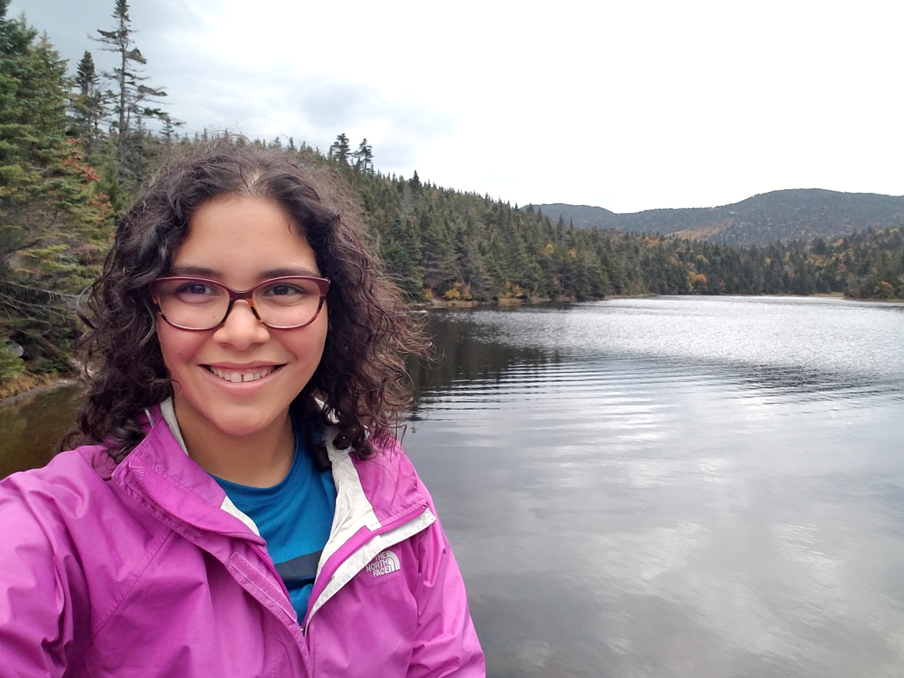

```{r setup, include=FALSE}
knitr::opts_chunk$set(echo = TRUE)
```


  

<br />

### Homeworks  
* #### [Typora](TyporaPractice.html)
* #### [Regular Expressions](Homework3.html)
* #### [Vectors](Homework4.html)

<br />
***  

### Aura M. Alonso-Rodriguez, MSc  
PhD Student | NSF [QuEST](https://www.uvm.edu/quest) Trainee | [Gund](https://www.uvm.edu/gund) Graduate Fellow  
[Rubenstein](https://www.uvm.edu/rsenr) School of Environment and Natural Resources  
University of Vermont, Burlington, VT  
<Aura.Alonso-Rodriguez@uvm.edu>  
[Twitter](https://twitter.com/AuraAlonsoRodz) |
[Research Gate](https://www.researchgate.net/profile/Aura_Alonso-Rodriguez)  


